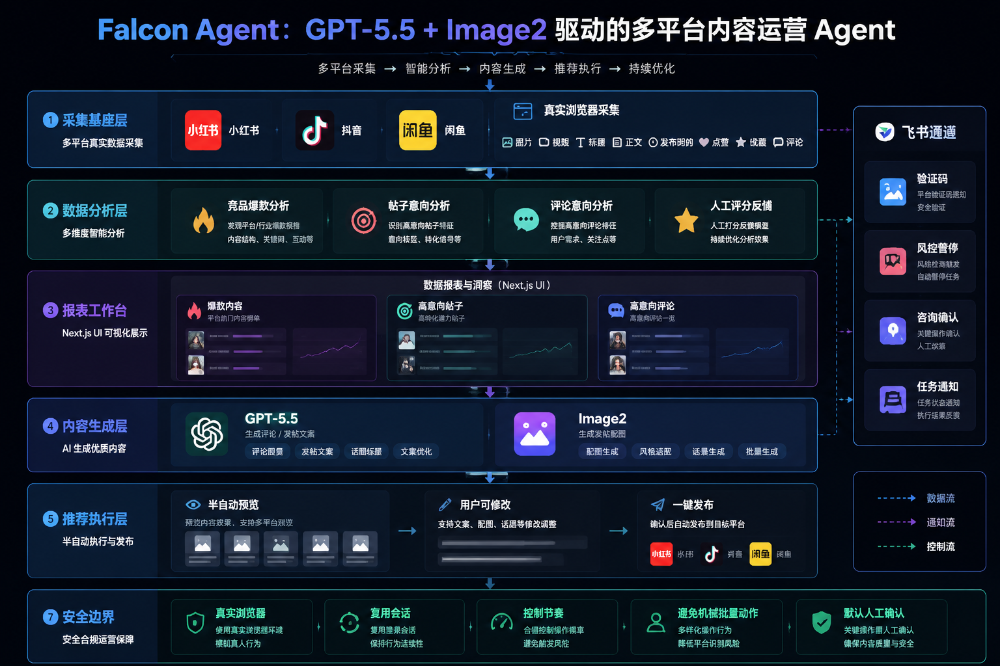

# Falcon Agent

Falcon Agent 是一个独立的本地自动化采集、分析和运营平台。项目正在从旧的外部工作流采集方案，重建为 Falcon 自己掌控的浏览器采集、数据整理、分析生成和人工确认执行工作台。

当前仓库只保留 `main` 分支作为共享主线。Windows 和 M1 Mac 两台机器都从 GitHub 拉取同一份代码继续开发。



## 项目定位

Falcon 的目标不是服务某一个固定项目，而是成为一个本地优先、人工可控的通用运营系统：

- 用真实浏览器采集公开平台信号，优先支持小红书。
- 将帖子、作者、互动指标、评论、媒体资产和原始证据归一化保存到本地。
- 把采集样本推进到分析池，辅助识别选题、痛点、趋势和可复用表达。
- 使用 GPT-5.5 处理分析、总结和文案生成。
- 使用 Image2 生成封面或辅助视觉资产。
- 在执行前给出可检查、可修改、可确认的预览，最终发布、评论、私信等动作必须由人确认。

Codex 只作为开发助手存在，不是产品运行时的一部分。项目不会再依赖旧的外部工作流构建器作为采集路径。

## 当前阶段

当前开发重点是 Falcon 自有浏览器采集工作台和本地分析闭环。已经落地的核心能力包括：

- Web 工作台页面拆分为仪表盘、采集首页、采集队列、创建任务、账号资料、环境检查、任务详情、样本预览、分析首页、分析样本、人工审阅、执行预览、任务队列、关键词和报告等模块。
- 小红书采集优先落地，支持 profile 登录、队列创建、启动、继续、归档、重跑、人工处理窗口和 profile 冲突提示。
- 本地保存规范化帖子、媒体资产、证据文件和采集事件；`data/`、`runtime/collector/`、`browser-profiles/` 等运行目录不进入 Git。
- 相关性质量策略已经改为默认优质：采集样本默认写入 `100 / excellent / primary` 并进入主分析，人工校准可将单条样本降级为参考或跳过。
- 任务详情和样本预览已优化评分展示，质量闸门展示成果状态，人工校准控件更紧凑。
- 分析、报告、人工审阅、外联任务和执行预览的基础模型与页面已经保留并持续接入新的采集数据。
- GPT-5.5 和 Image2 客户端保留为可配置能力，真实密钥只放在本地 `.env`。

## 产品边界

Falcon 以“人确认后执行”为原则：

- 不自动批量发帖、评论或私信。
- 登录、验证码、风控、账号切换和最终发布都需要人工处理。
- 不把 cookies、tokens、验证码、真实 API key、浏览器 profile、运行日志、生成报告等本地敏感数据提交到 Git。
- 不恢复已经删除的旧采集适配器、旧工作流记录或旧外部采集文档。

## 使用工作流

```text
配置账号 profile / 完成人工登录
  -> 创建采集任务
  -> 启动或继续浏览器采集
  -> 查看任务详情、样本、资产和证据
  -> 默认进入主分析，必要时人工校准样本质量
  -> 推进到分析池
  -> 生成洞察、选题、文案和视觉资产
  -> 进入人工审阅和执行预览
  -> 人确认后再进行平台动作
```

## 快速启动

Windows PowerShell：

```powershell
.\scripts\start.ps1
```

macOS：

```bash
chmod +x scripts/start.sh
./scripts/start.sh
```

启动脚本会安装 Python editable package、安装 Node sidecar 依赖、安装 Playwright Chromium、创建本地运行目录、初始化 SQLite 数据库，并启动本地 Web 工作台。端口 `8765` 被占用时会自动尝试下一个可用端口。

依赖已安装后可以快速启动：

```powershell
.\scripts\start.ps1 -SkipInstall
```

```bash
./scripts/start.sh --skip-install
```

默认访问地址：

```text
http://127.0.0.1:8765
```

## 常用命令

环境检查：

```powershell
py -3 -m falcon doctor --ensure-dirs
```

```bash
python3 -m falcon doctor --ensure-dirs
```

初始化数据库：

```powershell
py -3 -m falcon --db data\falcon.sqlite3 init-db
```

```bash
python3 -m falcon --db data/falcon.sqlite3 init-db
```

启动 Web 工作台：

```powershell
py -3 -m falcon web --host 127.0.0.1 --port 8765 --db data\falcon.sqlite3
```

```bash
python3 -m falcon web --host 127.0.0.1 --port 8765 --db data/falcon.sqlite3
```

生成关键词池：

```powershell
py -3 -m falcon write-keyword-pool data\collection_keywords.csv --theme "内容运营"
```

```bash
python3 -m falcon write-keyword-pool data/collection_keywords.csv --theme "内容运营"
```

运行分析和报告：

```powershell
py -3 -m falcon --db data\falcon.sqlite3 analyze --drafts template
py -3 -m falcon --db data\falcon.sqlite3 report --output reports\daily-report.md
```

```bash
python3 -m falcon --db data/falcon.sqlite3 analyze --drafts template
python3 -m falcon --db data/falcon.sqlite3 report --output reports/daily-report.md
```

小红书 profile 登录：

```powershell
node sidecar\collector\profile-login.mjs --platform xiaohongshu --profile default
```

```bash
node sidecar/collector/profile-login.mjs --platform xiaohongshu --profile default
```

采集 sidecar 语法检查：

```powershell
node --check sidecar\collector\index.mjs
node --check sidecar\collector\xiaohongshu.mjs
node --check sidecar\collector\xiaohongshu-normalize.mjs
node --check sidecar\collector\profile-login.mjs
```

```bash
node --check sidecar/collector/index.mjs
node --check sidecar/collector/xiaohongshu.mjs
node --check sidecar/collector/xiaohongshu-normalize.mjs
node --check sidecar/collector/profile-login.mjs
```

## 配置

复制 `.env.example` 为本地 `.env`，填写自己的中转服务和 API key。`.env` 已被 Git 忽略。

GPT-5.5：

```text
FALCON_GPT_BASE_URL=
FALCON_GPT_ENDPOINT=/v1/chat/completions
FALCON_GPT_API_KEY=
FALCON_GPT_MODEL=gpt-5.5
FALCON_GPT_TIMEOUT=60
```

Image2：

```text
FALCON_IMAGE2_PRIMARY_BASE_URL=
FALCON_IMAGE2_PRIMARY_API_KEY=
FALCON_IMAGE2_FALLBACK_BASE_URL=
FALCON_IMAGE2_FALLBACK_API_KEY=
FALCON_IMAGE2_ENDPOINT=/v1/images/generations
FALCON_IMAGE2_MODEL=gpt-image-2
FALCON_IMAGE2_TIMEOUT=90
FALCON_IMAGE2_SIZE=1536x1024
```

不要把真实密钥、cookies、tokens、验证码或本地 profile 提交到仓库。

## 目录说明

- `falcon/`：Python 领域模型、SQLite repository、CLI、分析、报告、Web 应用和工作流服务。
- `falcon/web/templates/`：Jinja 页面模板。
- `falcon/web/static/`：工作台样式和前端静态资源。
- `sidecar/collector/`：Node/Playwright 浏览器采集 sidecar 和平台适配器。
- `tests/`：Python 单元测试和 Web/workflow/sidecar contract 测试。
- `docs/progress.md`：每次提交前必须更新的双机交接进度。
- `docs/development-guide.md`：开发、测试、采集和故障排查指南。
- `docs/design/falcon-layout-redesign-v2/`：当前最新整站设计参考；`falcon-layout-redesign-v1/` 保留用于视觉对照。
- `data/`、`runtime/collector/`、`browser-profiles/`：本地运行目录，默认不进入 Git。

## 开发交接

每次开始开发前：

```bash
git pull
```

然后阅读：

- `AGENTS.md`
- `docs/progress.md`
- `docs/development-guide.md`
- `README.md`
- `project.md`

提交前必须完成：

- 运行相关测试或 smoke workflow。
- 更新 `docs/progress.md`，写清当前进度、验证结果、已知问题和下一步。
- 确认 `git status -sb` 只包含本次要提交的文件。
- commit 后 push 到 GitHub 的 `main` 分支。

基线测试：

```powershell
py -3 -m unittest discover -s tests
py -3 -m compileall falcon
```

```bash
python3 -m unittest discover -s tests
python3 -m compileall falcon
```
